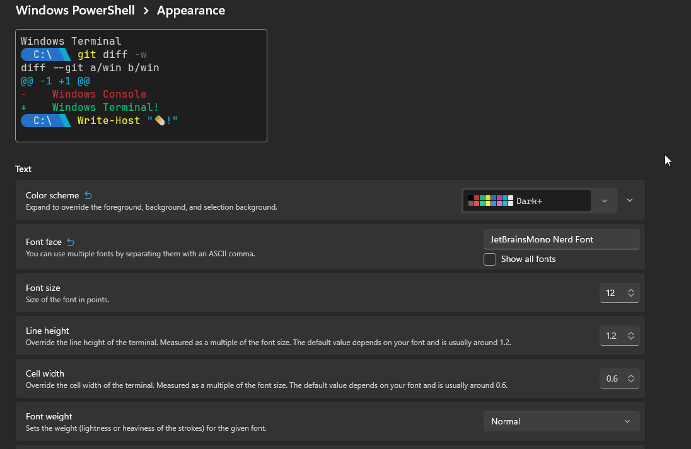

# WinGet 

Use the following command to quickly install all available programs on winget. 
*(Note: Some programs must be manually installed. See the Manual Install Programs section below.)*

```powershell
# First, Loosen security for script execution
Set-ExecutionPolicy -Scope Process -ExecutionPolicy Bypass -Force

# Second, Run the script
& ".\launch_new_machine_install_script.ps1"
```

- [ ] [Blender](https://www.blender.org/download/)
	```powershell
	winget install -e --id BlenderFoundation.Blender
	```
- [ ] [Zen Browser](https://zen-browser.app/download/) 
	```powershell
	winget install -e --id Zen-Team.Zen-Browser
	```
- [ ] [Visual Studio Build Tools](https://visualstudio.microsoft.com/downloads/#build-tools-for-visual-studio-2022) 
	```powershell
	winget install -e --id Microsoft.VisualStudio.2022.BuildTools
	```
- [ ] [Java (OpenJDK 21)](https://learn.microsoft.com/java/openjdk/download) 
	```powershell
	winget install -e --id Microsoft.OpenJDK.21
	```
- [ ] [NVIDIA CUDA](https://developer.nvidia.com/cuda-downloads)
	```powershell
	winget install -e --id Nvidia.CUDA
	```
- [ ] [PDFGear](https://www.pdfgear.com/)
	```powershell
	winget install -e --id PDFgear.PDFgear
	```
- [ ] [PowerToys](https://learn.microsoft.com/en-us/windows/powertoys/)
	```powershell
	winget install -e --id Microsoft.PowerToys
	```
- [ ] [GitHub Desktop](https://desktop.github.com/download/)
	```powershell
	winget install -e --id GitHub.GitHubDesktop
	```
- [ ] [Cascadeur](https://cascadeur.com/download)
	```powershell
	winget install -e --id XPFMG5VK7FJPXL --source msstore
	```
- [ ] [yt-dlp](https://github.com/yt-dlp/yt-dlp)
	```powershell
	winget install -e --id yt-dlp.yt-dlp
	```
- [ ] [HandBrake](https://handbrake.fr/)
	```powershell
	winget install -e --id HandBrake.HandBrake
	```
- [ ] [jq](https://jqlang.org/download/)
	```powershell
	winget install -e --id jqlang.jq
	```
- [ ] [Obsidian](https://obsidian.md/download)
	```powershell
	winget install -e --id Obsidian.Obsidian
	```
- [ ] [JetBrains Toolbox](https://www.jetbrains.com/toolbox-app/)
	```powershell
	winget install -e --id JetBrains.Toolbox
	```
- [ ] [Steam](https://store.steampowered.com/about/)
	```powershell
	winget install -e --id Valve.Steam
	```
- [ ] [Epic Games Launcher](https://store.epicgames.com/en-US/download)
	```powershell
	winget install -e --id EpicGames.EpicGamesLauncher
	```
- [ ] [Unity Hub](https://unity.com/download)
	```powershell
	winget install -e --id Unity.UnityHub
	```
- [ ] [MSI Afterburner](https://www.msi.com/Landing/afterburner/graphics-cards)
	```powershell
	winget install -e --id Guru3D.Afterburner
	```
- [ ] [F3D](https://f3d.app/doc/user/INSTALLATION.html)
	```powershell
	winget install -e --id f3d-app.f3d
	```
- [ ] [JetBrains Mono Nerd Font](https://www.nerdfonts.com/font-downloads)
	```powershell
	winget install -e --id DEVCOM.JetBrainsMonoNerdFont
	```
- [ ] [OBS Studio](https://obsproject.com)
	```powershell
	winget install -e --id OBSProject.OBSStudio
	```
- [ ] [Winaero Tweaker](https://winaero.com/winaero-tweaker/)
	```powershell
	winget install -e --id winaero.tweaker
	```
- [ ] [Git](https://git-scm.com/downloads)
	```powershell
	winget install -e --id Git.Git
	```
- [ ] [Aria2](https://github.com/aria2/aria2)
	```powershell
	winget install -e --id aria2.aria2
	```
- [ ] [FFmpeg](https://ffmpeg.org/download.html)
	```powershell
	winget install -e --id Gyan.FFmpeg
	```
- [ ] [Python](https://www.python.org/downloads/windows/)
	```powershell
	winget install -e --id Python.Python.3.12
	```
- [ ] [uv](https://github.com/astral-sh/uv)
	```powershell
	winget install -e --id astral-sh.uv
	```
- [ ] [NVM for Windows](https://github.com/coreybutler/nvm-windows)
	```powershell
	winget install -e --id CoreyButler.NVMforWindows
	```
- [ ] [7-Zip](https://www.7-zip.org/)
	```powershell
	winget install -e --id 7zip.7zip
	```
- [ ] [Visual Studio Code](https://code.visualstudio.com/)
	```powershell
	winget install -e --id Microsoft.VisualStudioCode
	```
- [ ] [GIMP](https://www.gimp.org/downloads/)
	```powershell
	winget install -e --id GIMP.GIMP.3
	```
- [ ] [Inkscape](https://inkscape.org/release/)
	```powershell
	winget install -e --id Inkscape.Inkscape
	```
- [ ] [HWiNFO](https://www.hwinfo.com/download/)
	```powershell
	winget install -e --id REALiX.HWiNFO
	```
- [ ] [Greenshot](https://getgreenshot.org/downloads/)
	```powershell
	winget install -e --id Greenshot.Greenshot
	```
- [ ] [Notepad++](https://notepad-plus-plus.org/downloads/)
	```powershell
	winget install -e --id Notepad++.Notepad++
	```
- [ ] [Audacity](https://www.audacityteam.org/download/)
	```powershell
	winget install -e --id Audacity.Audacity
	```
- [ ] [foobar2000](https://www.foobar2000.org/download)
	```powershell
	winget install -e --id PeterPawlowski.foobar2000
	```
- [ ] [Bitwarden](https://bitwarden.com/download/)
	```powershell
	winget install -e --id Bitwarden.Bitwarden
	```
- [ ] [Google Chrome](https://www.google.com/chrome/)
	```powershell
	winget install -e --id Google.Chrome
	```
- [ ] [OpenCode](https://opencode.ai/)
	```powershell
	winget install -e --id SST.OpenCodeDesktop
	```
- [ ] [WinDirStat](https://windirstat.net/)
	```powershell
	winget install -e --id WinDirStat.WinDirStat
	```

## Manual Install Programs

Programs below should be installed manually. This includes packages not currently available in winget, plus high-priority tooling that is often better installed/configured directly.
- [ ] [WinHance](https://winhance.net/)
	```powershell
	irm "https://get.winhance.net" | iex
	``` 
- [ ] [OpenCode (see WSL and OpenCode section)](#wsl-and-opencode)
- [ ] [Visual Studio Build Tools](https://visualstudio.microsoft.com/downloads/#build-tools-for-visual-studio-2022)
	```powershell
	# Recommended manual install for Unreal/C++ setup:
	# 1) Open installer and select "Desktop development with C++"
	# 2) Include MSVC, Windows SDK, and CMake tools
	```

- [ ] [MemTest86](https://www.memtest86.com/download.htm)
	```powershell
	# Not currently available in winget
	```
- [ ] [FL Studio](https://www.image-line.com/fl-studio-download)
	```powershell
	# Not currently available in winget
	```
- [ ] [NVIDIA App](https://www.nvidia.com/en-us/software/nvidia-app/)
	```powershell
	# Not currently available in winget
	```
- [ ] [DaVinci Resolve](https://www.blackmagicdesign.com/products/davinciresolve)
	```powershell
	# Not currently available in winget
	# If the app doesn't show in Start Menu, run this in an elevated PowerShell:
	Copy-Item -Path "$env:APPDATA\Microsoft\Windows\Start Menu\Programs\Blackmagic Design\DaVinci Resolve\*.*" -Destination "$env:ALLUSERSPROFILE\Microsoft\Windows\Start Menu\Programs\Blackmagic Design\DaVinci Resolve\"
	```
- [ ] [Gemini CLI](https://github.com/google-gemini/gemini-cli)
	```powershell
	# Not currently available in winget
	```
- [ ] [pyenv-win](https://github.com/pyenv-win/pyenv-win)
	```powershell
	# Not currently available in winget
	```
- [ ] [GeForce Experience](https://www.nvidia.com/en-us/geforce/geforce-experience/download/)
	```powershell
	# Not currently available in winget
	```
- [ ] [Maven](https://maven.apache.org/download.cgi)
	```powershell
	# Not currently available in winget
	```
- [ ] [Ableton Live](https://www.ableton.com/en/account/) 
	```powershell
	# N/A
	```

---

# WSL and OpenCode

OpenCode works better on linux and thus we want to have it run inside WSL.

1. Follow the [WSL Installation Guide](https://learn.microsoft.com/en-us/windows/wsl/install) and install Arch Linux.
	```powershell
	wsl --update
	```
	```
	wsl --install archlinux
	```
2. Enter the distro `quick-setup.sh` in arch.
	```powershell
	wsl archlinux
	```
	```sh
	chmod +x quick-setup.sh
	```
	```sh
	./quick-setup.sh
	```
3. Follow the instructions and restart arch.
	```sh
	exit
	```
	```powershell
	wsl --terminate archlinux
	```
	```powershell
	wsl archlinux
	```

# Laptop Keyboard

Use PowerToy's **Keyboard Manager** to rebind `Caps Lock` to be `Backspace` **and** rebind `Caps Lock` to `Ctrl + Alt + Backspace`. (We use `Backspace` there because now the physical `Caps Lock` button has been remapped to it).
